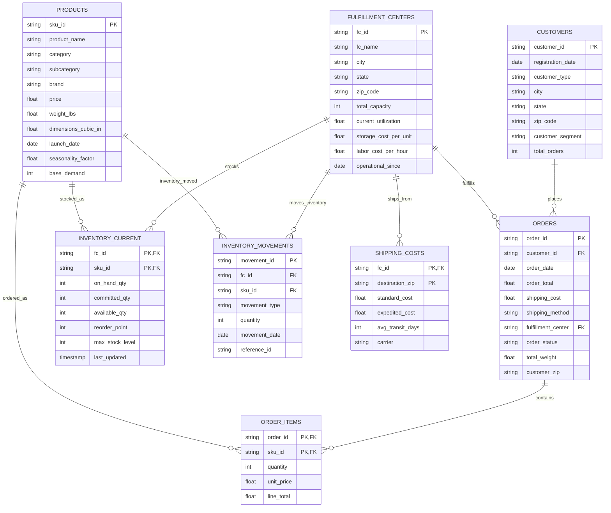

# Problem Definition & Scoping

## 1.1 Original Business Problem Statement

**Stakeholder:** Client Representive  
**Date:** 05/19/2025  
**Urgency:** High — Critical operational efficiency and cost impact

**Original Problem Description:**  
> "The company is experiencing high shipping costs, frequent stockouts, and excessive time spent on inventory redistribution across fulfillment centers, due to a one-size-fits-all stocking approach that doesn't account for regional or behavioral differences in customer demand."

## 1.2 Problem Decomposition

The problem encompasses multiple interconnected operational inefficiencies that need to be analyzed and prioritized:

### A. High Shipping Costs  
- **Core Problem:** Inefficient inventory placement leading to longer shipping distances and expedited fulfillment  
- **Impact:** Elevated operational expenses reduce profit margins  
- **Measurable Aspect:** Average cost per shipment, percentage of expedited shipments, cross-fulfillment center transfers

### B. Frequent Stockouts  
- **Core Problem:** Inadequate demand forecasting and inventory allocation are causing product unavailability  
- **Impact:** Lost sales, customer dissatisfaction, and reduced conversion rates  
- **Measurable Aspect:** Stockout frequency, fill rate percentage, lost sales revenue

### C. Excessive Inventory Redistribution Time  
- **Core Problem:** Manual and reactive inventory rebalancing processes consume operational resources  
- **Impact:** Staff time diverted from strategic activities, delayed inventory optimization  
- **Measurable Aspect:** Hours spent on redistribution activities, frequency of manual interventions

## 1.3 Problem Prioritization

Based on business impact and solution feasibility:

| Priority | Area                        | Reason                                                       |
|----------|----------------------------|--------------------------------------------------------------|
| 1        | Frequent Stockouts         | Directly impacts revenue and customer experience             |
| 2        | High Shipping Costs        | Immediate operational cost savings potential                 |
| 3        | Redistribution Efficiency  | Operational productivity improvement and resource optimization|

## 1.4 Focused Problem Statement

**Primary Focus:** Understand and address the root causes of inefficient inventory management that result in high shipping costs, frequent stockouts, and excessive redistribution efforts.

**Specific Problem Definition:**  
Determine how the current one-size-fits-all stocking approach fails to account for regional and behavioral differences in customer demand, leading to suboptimal inventory allocation across fulfillment centers. The core challenge is transforming a reactive, uniform inventory strategy into a predictive, segment-aware system that anticipates where specific products will be needed based on customer behavior patterns.

## 1.5 Success Criteria

**Primary Success Metrics:**  
- **Stockout Reduction:** Measurable decrease in stockout incidents (target: ≥15% reduction)  
- **Shipping Cost Optimization:** Reduction in average cost per shipment (target: ≥10% decrease)  
- **Operational Efficiency:** Reduction in manual redistribution time (target: ≥15 hours monthly savings)

**Secondary Success Metrics:**  
- **Forecast Accuracy:** Improved demand prediction accuracy (target: ≥5% MAPE improvement)  
- **Customer Satisfaction:** Maintained or improved order fulfillment experience  
- **Inventory Turnover:** Optimized inventory velocity across fulfillment centers

## 1.6 Scope Definition

### ✅ In Scope  
- Analysis of customer demand patterns and behavioral differences across regions  
- Evaluation of current inventory allocation and stocking strategies  
- Assessment of shipping cost drivers and stockout incident patterns  
- Historical analysis of redistribution activities and associated time investments  
- Understanding of fulfillment center performance variations and constraints  

### 🚫 Out of Scope  
- Changes to fulfillment center locations or physical infrastructure  
- Modifications to supplier relationships or procurement processes  
- Product assortment or pricing strategy adjustments  
- Third-party logistics provider changes or negotiations  
- Real-time inventory tracking system upgrades (using existing data feeds)

## 1.7 Assumptions & Constraints

**Assumptions:**  
- Sufficient historical customer transaction and behavioral data for clustering analysis  
- Accurate inventory movement and stockout tracking across fulfillment centers  
- Stable customer demand patterns allowing for predictive modeling  
- The existing data infrastructure can support new forecasting and allocation algorithms  

**Constraints:**  
- Limited to existing fulfillment center network and capacity constraints  
- Must work within current inventory management system capabilities  
- Seasonal and promotional demand variations may impact model accuracy  
- Implementation timeline constrained by IT development and testing cycles  

## 1.8 Stakeholder Alignment

**Primary Stakeholders:**  
- VP of Supply Chain Operations (Problem owner)  
- Fulfillment Center Managers  
- Inventory Planning Team  
- Customer Experience Team  
- Data Science and Analytics Team  

**Success Validation Process:**  
- Data quality assessment and model development by Week 4  
- Pilot implementation in selected fulfillment centers by Week 8  
- Full rollout and performance validation by Week 16  

**Communication Plan:**  
- Weekly progress updates to Supply Chain VP  
- Bi-weekly stakeholder review meetings with Fulfillment and Inventory teams  
- Monthly executive summary reporting on key performance indicators  

---
## 1.9 Problem Translation to Data Science Tasks

To address the business problem through data science, the following technical tasks were defined:

### A. Customer Segmentation  
- **Task Type:** Unsupervised Learning (Clustering)  
- **Goal:** Identify distinct customer behavioral and regional segments based on historical purchase patterns, geography, and engagement metrics  
- **Business Impact:** Enables fulfillment centers to stock inventory that reflects localized and behavioral demand patterns, moving away from the generic one-size-fits-all strategy

### B. SKU-Level Demand Forecasting  
- **Task Type:** Supervised Learning / Time Series Forecasting  
- **Goal:** Predict future demand for each SKU at the fulfillment center level, segmented by customer clusters  
- **Business Impact:** Improves inventory planning, reducing stockouts and overstocking

### C. Inventory Allocation Optimization  
- **Task Type:** Prescriptive Analytics / Decision Support  
- **Goal:** Use demand forecasts to inform and optimize inventory distribution across fulfillment centers  
- **Business Impact:** Reduces shipping costs and manual redistribution efforts by ensuring the right products are stocked closer to the customers who need them

### D. Data Engineering and Pipeline Automation  
- **Task Type:** Data Pipeline Design and ETL Automation  
- **Goal:** Build robust, scalable data pipelines using SQL-based cloud infrastructure to ingest, transform, and serve data to ML models  
- **Business Impact:** Ensures automation, reproducibility, and timely access to actionable insights

These data science components work in tandem to directly target the root causes of inefficiencies outlined in the original business problem.

---

*This section will be updated as new information or constraints arise during the project lifecycle.*
